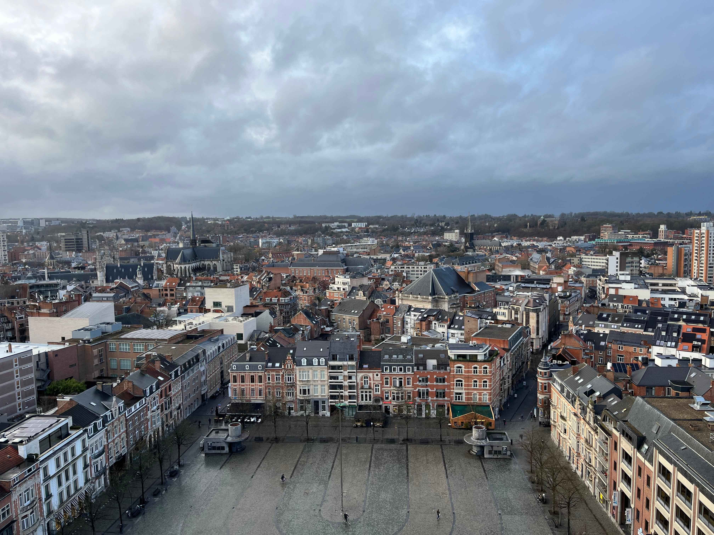
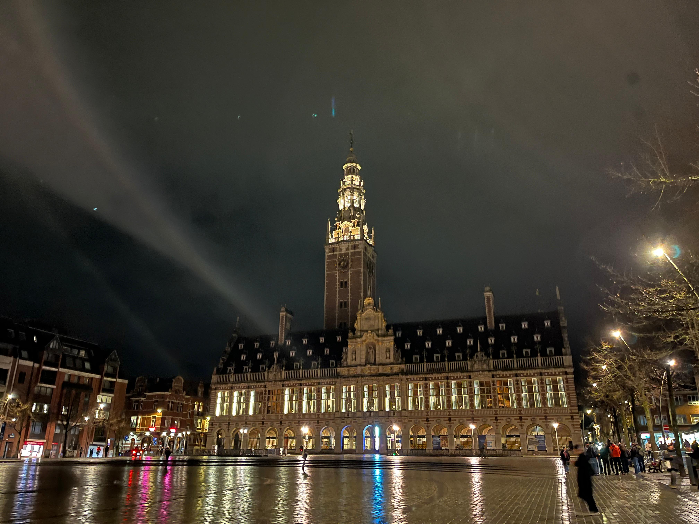
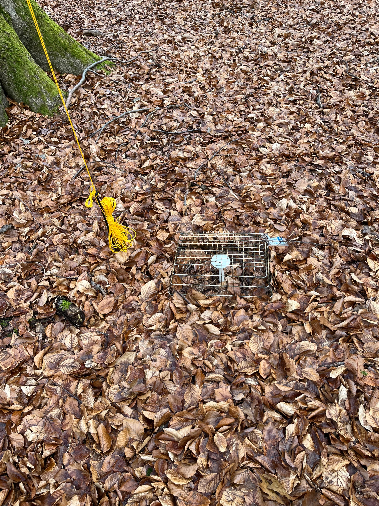

Last week, I co-led a workshop in Leuven, Belgium exploring the ecological applications of 3D microclimates. 

In addition to varying across horizontally across landscapes, microclimates vary from the ground to the canopy. While we know this vertical variation can be substantial, it is rarely considered in ecology. During the workshop we discussed the potential for considering this vertical variation in ecological disciplines from ecophysiology to biogeography. Moving forward, I'm excited to continue collaborating with the group on this topic. If you want to read more about my current research involving 3D microclimates, check out the project page [here](https://lydiasoifer.github.io/project/3d-ecology/).

Although I was in Belgium for less than a week, I had some time to explore KU Leuven, and found an excellent view of the city from the top of the library bell tower.

  

    
    
  

  

